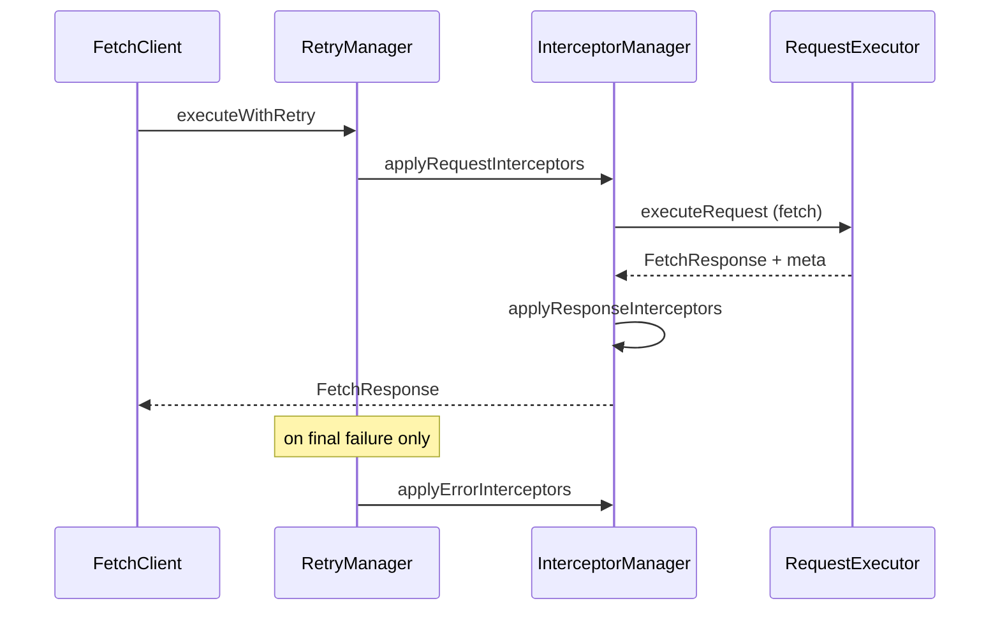

# Architecture: Core vs Plugins

> **Status:** v3 design draft — implemented in `src/core` and `src/plugins`.

## Goals

1. **Core tetap kecil** — fetch wrapper dengan timeout, retry, interceptors.
2. **Fitur berat opsional** — auth, upload, SSL via subpath import (tree-shakeable).
3. **Satu pipeline request** — semua HTTP lewat `FetchClient.request()` kecuali upload progress (XHR, terdokumentasi).
4. **Mudah dirawat** — tidak ada duplikasi `prepareRequestBody` / `createURL` di banyak class.

---

## Package layout

```
src/
├── core/                    # @myopentrip/fetch-client
│   ├── types.ts
│   ├── fetch-client.ts
│   ├── managers/
│   │   ├── request-executor.ts
│   │   ├── interceptor-manager.ts
│   │   └── retry-manager.ts
│   └── utils/
│       ├── request-helpers.ts
│       └── formatters.ts
├── plugins/
│   ├── auth/                # @myopentrip/fetch-client/auth
│   ├── upload/              # @myopentrip/fetch-client/upload
│   └── ssl/                 # @myopentrip/fetch-client/ssl
├── index.ts                 # core entry
├── auth.ts                  # auth plugin entry
├── upload.ts                # upload plugin entry
└── ssl.ts                   # ssl plugin entry
```

---

## Core (`FetchClient`)

### Responsibility

| Included | Excluded (→ plugin) |
|----------|---------------------|
| `baseURL`, default `headers`, `timeout` | Token storage / login |
| GET, POST, PUT, PATCH, DELETE | Multipart / progress upload |
| Request / response / error interceptors | SSL message transformer |
| Retry + backoff + jitter | Cookie storage helpers |
| `AbortSignal`, per-request `timeout` | |

### Public API (minimal)

```typescript
import { FetchClient, createFetchClient } from '@myopentrip/fetch-client';

const client = new FetchClient({
  baseURL: 'https://api.example.com',
  timeout: 10_000,
  headers: { Accept: 'application/json' },
  retries: 2,
  debug: false,
});

const { data } = await client.get<User[]>('/users');
await client.post('/users', { name: 'Ada' });

client.addRequestInterceptor((config) => config);
client.updateRetryConfig({ maxRetries: 3 });
```

### Request pipeline



### `RequestMeta`

Core menempelkan metadata ke response agar plugin bisa membuat keputusan tanpa global state:

```typescript
interface RequestMeta {
  path: string;
  method: HttpMethod;
  skipAuthRefresh?: boolean; // dipakai auth plugin pada login/logout/refresh
}
```

### Plugin hook (opsional)

```typescript
interface FetchClientPlugin {
  readonly name: string;
  setup(client: FetchClient): void | Promise<void>;
  teardown?(): void | Promise<void>;
}

await client.use(createSSLErrorPlugin({ debug: true }));
```

---

## Plugins

### Auth (`@myopentrip/fetch-client/auth`)

**Composition, bukan inheritance** — plugin memegang `FetchClient` dan mendaftarkan interceptors.

```typescript
import { FetchClient } from '@myopentrip/fetch-client';
import { createAuthPlugin } from '@myopentrip/fetch-client/auth';

const client = new FetchClient({ baseURL: 'https://api.example.com' });
const auth = await createAuthPlugin(client, {
  loginUrl: '/auth/login',
  tokenRefreshUrl: '/auth/refresh',
  storage: 'localStorage',
});

await auth.login({ email: 'a@b.com', password: '***' });
await client.get('/me'); // Authorization header otomatis
await auth.logout();
```

**Perilaku v3 (perbaikan bug v2):**

- `await createAuthPlugin()` — init async (load token) selesai sebelum dipakai.
- 401 + `refreshToken` → coba refresh (tidak bergantung `expiresAt`).
- Login/logout/refresh memakai `skipAuthRefresh` — tidak memicu refresh loop.
- `memory` storage — satu `Map` per instance plugin.
- Header auth lewat `mergeHeaders()` — aman untuk `Headers` / array.

**Tidak termasuk (sengaja):** retry request otomatis setelah refresh (caller bisa ulangi request; atau tambah di v3.1).

### Upload (`@myopentrip/fetch-client/upload`)

```typescript
import { createUploadPlugin } from '@myopentrip/fetch-client/upload';

const upload = createUploadPlugin(client);
await upload.uploadFile('/files', { file, fieldName: 'file' });
```

| Mode | Pipeline |
|------|----------|
| Tanpa `onProgress` | `client.request('POST', …)` — interceptors + retry |
| Dengan `onProgress` | XMLHttpRequest — **tanpa** retry/interceptor response; header dari `client.getDefaultHeaders()` |

### SSL (`@myopentrip/fetch-client/ssl`)

Error interceptor opsional — tidak lagi default-on di core.

```typescript
import { createSSLErrorPlugin } from '@myopentrip/fetch-client/ssl';
await client.use(createSSLErrorPlugin({ includeSuggestions: true }));
```

---

## Imports & bundle size

```typescript
// Hanya core (~minimal)
import { FetchClient } from '@myopentrip/fetch-client';

// Tambah auth saat perlu
import { createAuthPlugin } from '@myopentrip/fetch-client/auth';

// Tambah upload saat perlu
import { createUploadPlugin } from '@myopentrip/fetch-client/upload';
```

`package.json` `exports`:

```json
{
  ".": "./dist/index.js",
  "./auth": "./dist/auth.js",
  "./upload": "./dist/upload.js",
  "./ssl": "./dist/ssl.js"
}
```

---

## Migration dari v2

| v2 | v3 |
|----|-----|
| `new FetchClient({ auth: {...} })` | `createAuthPlugin(client, {...})` |
| `client.uploadFile(...)` | `createUploadPlugin(client).uploadFile(...)` |
| SSL default enabled | `client.use(createSSLErrorPlugin())` |
| `AuthManager` dari main export | `@myopentrip/fetch-client/auth` |
| `RequestConfig.retries` (tidak jalan) | Hapus — gunakan `client.updateRetryConfig()` |

---

## Future plugins (tidak di scope v3)

- `@myopentrip/fetch-client/cache` — response cache
- `@myopentrip/fetch-client/mock` — testing adapter
- Server middleware (lihat `proof-of-concept/server-package`) — package terpisah

---

## Principles

1. **Core tidak import plugin** — dependency satu arah: plugin → core.
2. **Shared logic di `request-helpers`** — satu sumber untuk URL, body, headers.
3. **Plugin = setup interceptors + API domain** — tidak duplikasi executor.
4. **Dokumentasikan escape hatch** — upload XHR adalah pengecualian yang disengaja.
