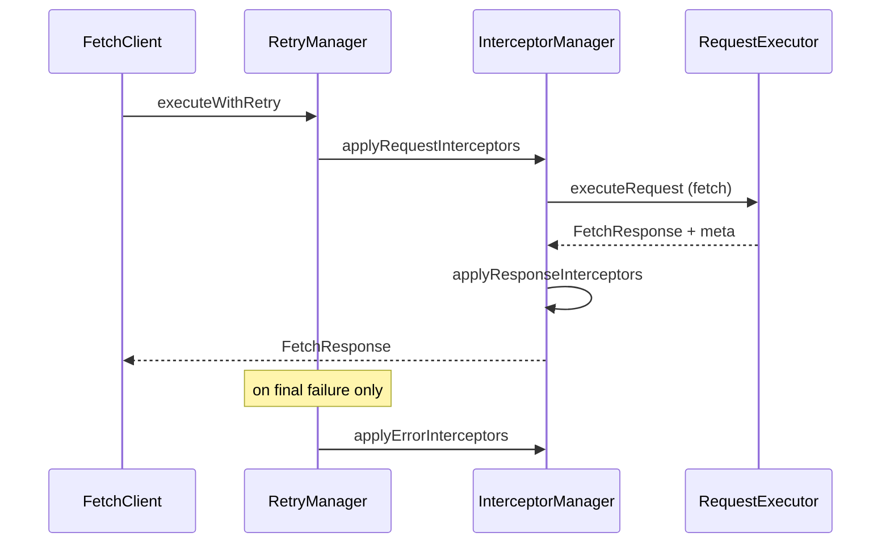

# Architecture: Core vs Plugins

> **Status:** v3 — implemented in `src/core` and `src/plugins`.

## Goals

1. **Keep the core small** — a fetch wrapper with timeout, retry, and interceptors.
2. **Heavy features are optional** — auth, upload, and SSL via subpath imports (tree-shakeable).
3. **Single request pipeline** — all HTTP goes through `FetchClient.request()`, except upload with progress (XHR, documented).
4. **Easy to maintain** — no duplicated `prepareRequestBody` / `createURL` logic across classes.

---

## Package layout

```
src/
├── core/                    # @myopentrip/fetch-client
│   ├── types.ts
│   ├── fetch-client.ts
│   ├── managers/
│   │   ├── request-executor.ts
│   │   ├── interceptor-manager.ts
│   │   └── retry-manager.ts
│   └── utils/
│       ├── request-helpers.ts
│       └── formatters.ts
├── plugins/
│   ├── auth/                # @myopentrip/fetch-client/auth
│   ├── upload/              # @myopentrip/fetch-client/upload
│   └── ssl/                 # @myopentrip/fetch-client/ssl
├── index.ts                 # core entry
├── auth.ts                  # auth plugin entry
├── upload.ts                # upload plugin entry
└── ssl.ts                   # ssl plugin entry
```

---

## Core (`FetchClient`)

### Responsibility

| Included | Excluded (→ plugin) |
|----------|---------------------|
| `baseURL`, default `headers`, `timeout` | Token storage / login |
| GET, POST, PUT, PATCH, DELETE | Multipart / progress upload |
| Request / response / error interceptors | SSL message transformer |
| Retry + backoff + jitter | Cookie storage helpers |
| `AbortSignal`, per-request `timeout` | |

### Public API (minimal)

```typescript
import { FetchClient, createFetchClient } from '@myopentrip/fetch-client';

const client = new FetchClient({
  baseURL: 'https://api.example.com',
  timeout: 10_000,
  headers: { Accept: 'application/json' },
  retries: 2,
  debug: false,
});

const { data } = await client.get<User[]>('/users');
await client.post('/users', { name: 'Ada' });

client.addRequestInterceptor((config) => config);
client.updateRetryConfig({ maxRetries: 3 });
```

### Request pipeline



Error interceptors may return a `FetchResponse` to recover from an error (used by the auth plugin for 401 retry).

### `RequestMeta`

The core attaches metadata to every response so plugins can make decisions without global state:

```typescript
interface RequestMeta {
  path: string;
  method: HttpMethod;
  skipAuthRefresh?: boolean; // used by auth plugin on login/logout/refresh
  authRetried?: boolean;     // internal: prevents infinite retry after refresh
}
```

### Plugin hook (optional)

```typescript
interface FetchClientPlugin {
  readonly name: string;
  setup(client: FetchClient): void | Promise<void>;
  teardown?(): void | Promise<void>;
}

await client.use(createSSLErrorPlugin({ debug: true }));
```

---

## Plugins

### Auth (`@myopentrip/fetch-client/auth`)

**Composition, not inheritance** — the plugin holds a `FetchClient` reference and registers interceptors.

```typescript
import { FetchClient } from '@myopentrip/fetch-client';
import { createAuthPlugin } from '@myopentrip/fetch-client/auth';

const client = new FetchClient({ baseURL: 'https://api.example.com' });
const auth = await createAuthPlugin(client, {
  loginUrl: '/auth/login',
  tokenRefreshUrl: '/auth/refresh',
  storage: 'localStorage',
});

await auth.login({ email: 'a@b.com', password: '***' });
await client.get('/me'); // Authorization header added automatically
await auth.logout();
```

**v3 behavior (fixes from v2):**

- `await createAuthPlugin()` — async init (load tokens) completes before use.
- 401 + `refreshToken` → attempt refresh (does not require `expiresAt`).
- Login/logout/refresh use `skipAuthRefresh` — avoids refresh loops.
- `memory` storage — one `Map` per plugin instance.
- Auth headers via `mergeHeaders()` — safe for `Headers` objects and arrays.

**Retry after refresh:** on 401, after a successful refresh, the original request is retried once (`authRetried` in meta prevents loops). Parallel 401s wait for **one** refresh wave (`recoveryPromise` + refcount), then each failed request retries individually.

**One plugin per client:** `createAuthPlugin(client)` is stored in a `WeakMap` — a second call returns the same instance. `auth.teardown()` unregisters it so a new plugin can be attached. Use `AuthPlugin.getForClient(client)` to check registration.

| Option | Default | Description |
|--------|---------|-------------|
| `autoRefresh` | `true` | Register 401 error recovery |
| `retryAfterRefresh` | `true` | Retry the failed request after refresh |

### Upload (`@myopentrip/fetch-client/upload`)

```typescript
import { createUploadPlugin } from '@myopentrip/fetch-client/upload';

const upload = createUploadPlugin(client);
await upload.uploadFile('/files', { file, fieldName: 'file' });
```

| Mode | Pipeline |
|------|----------|
| Without `onProgress` | `client.request('POST', …)` — interceptors + retry |
| With `onProgress` | XMLHttpRequest — **no** response interceptors or retry; headers from `client.getDefaultHeaders()` |

### SSL (`@myopentrip/fetch-client/ssl`)

Optional error interceptor — no longer enabled by default in core.

```typescript
import { createSSLErrorPlugin } from '@myopentrip/fetch-client/ssl';
await client.use(createSSLErrorPlugin({ includeSuggestions: true }));
```

---

## Imports & bundle size

```typescript
// Core only (~minimal)
import { FetchClient } from '@myopentrip/fetch-client';

// Add auth when needed
import { createAuthPlugin } from '@myopentrip/fetch-client/auth';

// Add upload when needed
import { createUploadPlugin } from '@myopentrip/fetch-client/upload';
```

`package.json` `exports`:

```json
{
  ".": "./dist/index.js",
  "./auth": "./dist/auth.js",
  "./upload": "./dist/upload.js",
  "./ssl": "./dist/ssl.js"
}
```

---

## Migration from v2

| v2 | v3 |
|----|-----|
| `new FetchClient({ auth: {...} })` | `createAuthPlugin(client, {...})` |
| `client.login()` / `client.uploadFile()` | `auth.login()` / `upload.uploadFile()` |
| SSL enabled by default | `await client.use(createSSLErrorPlugin())` |
| `AuthManager` from main export | `@myopentrip/fetch-client/auth` |
| `RequestConfig.retries` (not implemented) | Removed — use `client.updateRetryConfig()` |
| `FetchResponse` without `meta` | `meta: { path, method }` on every response |

---

## Future plugins (out of v3 scope)

- `@myopentrip/fetch-client/cache` — response cache
- `@myopentrip/fetch-client/mock` — testing adapter
- Server middleware (see `proof-of-concept/server-package`) — separate package

---

## Principles

1. **Core must not import plugins** — one-way dependency: plugin → core.
2. **Shared logic lives in `request-helpers`** — single source for URL, body, and headers.
3. **Plugin = register interceptors + domain API** — no duplicated executor logic.
4. **Document escape hatches** — upload via XHR is an intentional exception.
