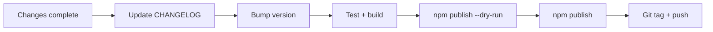

# Publishing to npm

This guide covers how to prepare and publish a new version of **`@myopentrip/fetch-client`** to [npm](https://www.npmjs.com/).

## Package overview

| Item | Value |
|------|--------|
| Name | `@myopentrip/fetch-client` |
| Scope | `@myopentrip` (scoped package) |
| Published output | `dist/` only (`files` in `package.json`) |
| Entry points | `.`, `./auth`, `./upload`, `./ssl` |
| Build | `tsup` (CJS + ESM + `.d.ts`) |
| Package manager | `pnpm@10.12.1` |

The `prepublishOnly` script in `package.json` runs `clean` + `build` before publish — do not rely on a stale `dist/` in your working tree.

---

## Prerequisites

### 1. npm account & scope access

- Logged-in npm account: `npm whoami`
- Permission to publish under the **`@myopentrip`** scope (npm org membership or package owner).
- For the **first** public publish of a scoped package, you must use `--access public` (see [Publish](#publish-to-npm)).

### 2. Registry login

```bash
npm login
# or, for CI with a token:
# npm config set //registry.npmjs.org/:_authToken=<NPM_TOKEN>
```

Ensure the registry points at the public npm registry (not a private mirror), unless intentional:

```bash
npm config get registry
# Expected: https://registry.npmjs.org/
```

### 3. Local dependencies

```bash
pnpm install
```

---

## Recommended release flow



---

## Pre-publish checklist

Use this for every release:

- [ ] All changes are committed (ideally on `main` or a release branch).
- [ ] **[CHANGELOG.md](../CHANGELOG.md)** is updated for the version you are releasing (breaking / features / fixes).
- [ ] **[README.md](../README.md)** still matches the API for that version (especially after breaking changes such as v3).
- [ ] **`package.json`** version is bumped and follows [Semver](#versioning-semver).
- [ ] No secrets (`.env`, tokens, credentials) will be published — only `dist/` contents plus `package.json` metadata are shipped.
- [ ] Manual tests / examples (at minimum what is relevant):

  ```bash
  pnpm run build
  pnpm test
  ```

- [ ] **Dry-run** publish succeeds and the file list looks correct (see below).
- [ ] For **major** releases (e.g. 3.x → 4.x): migration notes are ready in CHANGELOG / README.

---

## Versioning (Semver)

Follow [Semantic Versioning](https://semver.org/):

| Change type | Bump | Example |
|-------------|------|---------|
| Breaking API or behavior | **major** | `3.0.0` → `4.0.0` |
| Backward-compatible feature | **minor** | `3.0.0` → `3.1.0` |
| Bug fixes only | **patch** | `3.0.0` → `3.0.1` |

### Bumping the version

**Manual** — edit `"version"` in `package.json`, then commit.

**Via npm** (updates `package.json` only; no git tag unless you pass flags):

```bash
# patch: 3.0.0 → 3.0.1
npm version patch

# minor: 3.0.0 → 3.1.0
npm version minor

# major: 3.0.0 → 4.0.0
npm version major
```

Commit the version bump and CHANGELOG before publishing.

---

## Local build

```bash
pnpm run clean
pnpm run build
```

Confirm artifacts exist for every entry:

- `dist/index.{js,mjs,d.ts}`
- `dist/auth.{js,mjs,d.ts}`
- `dist/upload.{js,mjs,d.ts}`
- `dist/ssl.{js,mjs,d.ts}`

`prepublishOnly` runs the same commands when you `npm publish`.

---

## Dry-run (required)

Simulate the tarball **without** uploading to the registry:

```bash
npm publish --dry-run
```

Verify:

1. **Version** in the output matches what you intend to ship.
2. Only files under `dist/` are included (`files` limits the tarball to `dist`; the npm package page still shows README from package metadata).
3. No unexpected paths from the working tree.

For a public scoped package, also use:

```bash
npm publish --dry-run --access public
```

---

## Publish to npm

From the repository root:

```bash
npm publish --access public
```

> **Note:** `@myopentrip/fetch-client` is a **scoped package**. Without `--access public`, npm treats it as **private** by default (paid scope). It is safe to pass this flag on every publish after the first public release.

Optional one-time setup in `package.json` so you do not forget the flag:

```json
"publishConfig": {
  "access": "public"
}
```

After a successful publish, verify:

```bash
npm view @myopentrip/fetch-client version
npm view @myopentrip/fetch-client versions --json
```

Test install:

```bash
pnpm add @myopentrip/fetch-client@<version>
# or
npm install @myopentrip/fetch-client@<version>
```

Test subpath exports:

```typescript
import { FetchClient } from '@myopentrip/fetch-client';
import { createAuthPlugin } from '@myopentrip/fetch-client/auth';
import { createUploadPlugin } from '@myopentrip/fetch-client/upload';
import { createSSLErrorPlugin } from '@myopentrip/fetch-client/ssl';
```

---

## Git tag & GitHub (recommended)

After a successful publish, tag the release in git so it matches npm:

```bash
git tag v3.0.0
git push origin v3.0.0
```

Optional: create a [GitHub Release](https://github.com/myopentrip/fetch-client/releases) using the CHANGELOG entry for that version.

---

## CI / automation (optional)

Example GitHub Actions flow:

1. Trigger on tag `v*.*.*` or a manual workflow.
2. `pnpm install` → `pnpm run build` → tests.
3. `npm publish --access public` with an `NPM_TOKEN` secret (automation token or granular **Publish** permission for this package).
4. Never commit `NPM_TOKEN`.

`prepublishOnly` still runs in CI during `npm publish`, so pipeline and local builds stay aligned.

---

## Common issues

| Symptom | Likely cause | Fix |
|--------|----------------|--------|
| `403 Forbidden` | No access to `@myopentrip` scope | Request npm org invite or package owner role |
| `402 Payment Required` / private | Scoped publish without `--access public` | `npm publish --access public` |
| `403` version already exists | Same version was published before | Bump patch/minor/major; npm does not allow republishing the same version |
| Wrong types or imports after publish | Skipped build or dirty `dist` | `pnpm run clean && pnpm run build`, re-check dry-run |
| Only `index` works | `auth` / `upload` / `ssl` entries not built | Check `tsup.config.ts` entries and `exports` in `package.json` |

### Unpublish / deprecate

- **Unpublish** (< 72 hours, no dependents) is heavily restricted — avoid except in emergencies.
- Safer approach: **deprecate** a bad version:

  ```bash
  npm deprecate @myopentrip/fetch-client@3.0.0 "Reason message"
  ```

---

## Quick command reference

```bash
# Prepare
pnpm install
pnpm run build
pnpm test

# Version (example: patch)
npm version patch

# Inspect package
npm publish --dry-run --access public

# Publish
npm publish --access public

# Verify
npm view @myopentrip/fetch-client version
```

---

## Related docs

- [ARCHITECTURE.md](./ARCHITECTURE.md) — core vs plugins (important for major release notes).
- [CHANGELOG.md](../CHANGELOG.md) — version history for npm and GitHub Releases.
- [README.md](../README.md) — user-facing docs after installing from npm.
